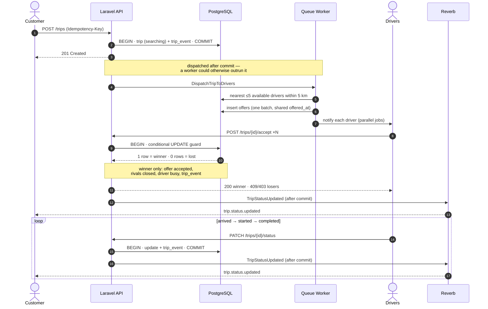
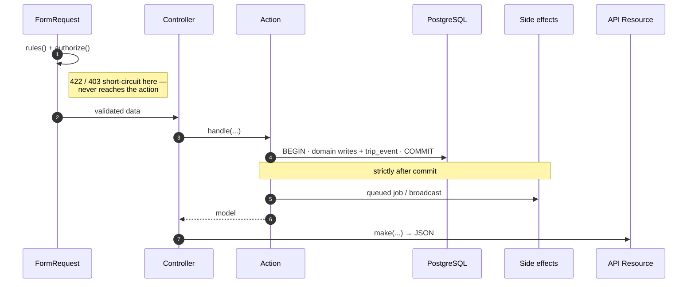
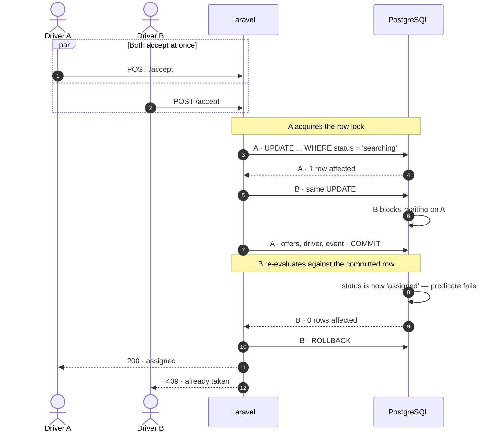
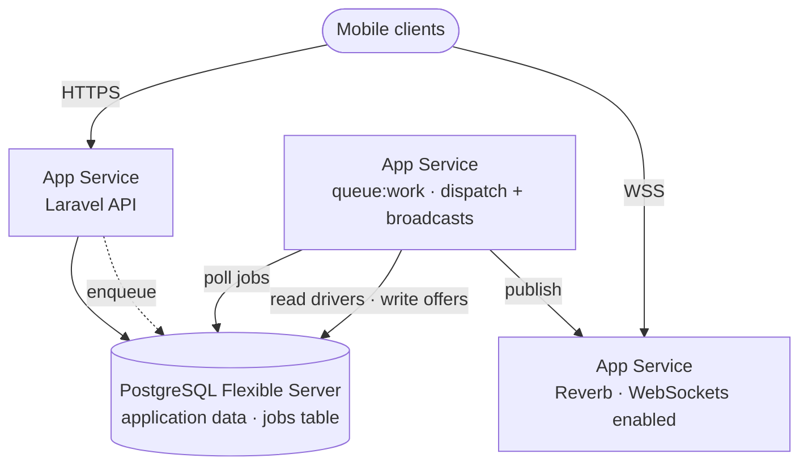
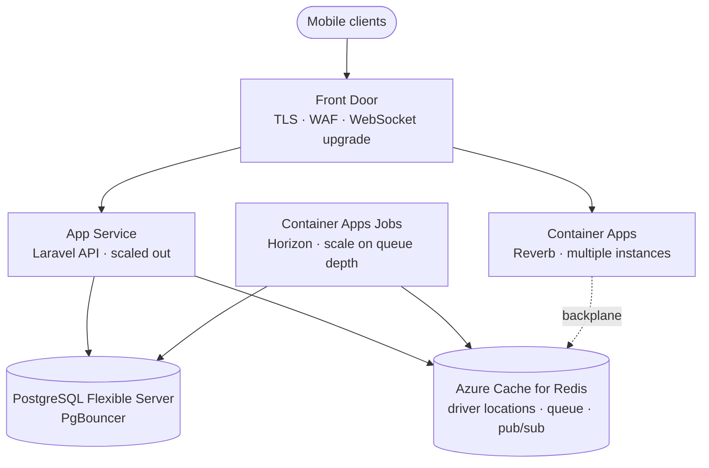

# RoadAssist — Real-Time Driver Dispatch API

Laravel + PostgreSQL backend for roadside assistance. A customer requests a tow,
the system offers it to the nearest available drivers at once, and **the first
driver to accept wins**. The customer watches progress live over WebSockets.

That last constraint — exactly one winner when five drivers tap "accept"
simultaneously — drove most of the design below.

---

## Quick start

**Requires** PHP 8.2+, PostgreSQL 15+, Composer, Node 18+ (verification script only).

```bash
composer install && cp .env.example .env && php artisan key:generate
```

> `.env.example` ships `BROADCAST_CONNECTION=log`. **Set it to `reverb`** — the
> `REVERB_*` credentials are already filled in, but without this line events
> broadcast to the log file instead of the WebSocket server.

```sql
CREATE DATABASE road_assist;
CREATE DATABASE road_assist_testing;
```

```bash
php artisan migrate --seed
```

**Three processes in development:**

```bash
php artisan serve          # API
php artisan queue:work     # dispatch + broadcast delivery
php artisan reverb:start   # WebSockets
```

Or start all of them (plus Vite and log tailing) with one command:

```bash
composer run dev
```

> Without the queue worker, trips are created but no driver is ever offered the
> job and no status update reaches the customer. Jobs pile up in the `jobs`
> table. This is the usual "nothing is happening" cause.

| Variable | `.env` | Tests | Why |
|---|---|---|---|
| `DB_DATABASE` | `road_assist` | `road_assist_testing` *(`.env.testing`)* | Tests never touch dev data |
| `QUEUE_CONNECTION` | `database` | `sync` *(`.env.testing`)* | Real async in dev, inline in tests |
| `BROADCAST_CONNECTION` | `reverb` | `null` *(`phpunit.xml`)* | Tests fake events |

Note the third row's source: `.env.testing` sets no broadcast driver at all —
the `null` value comes from `phpunit.xml`'s explicit `<env>` override, which
takes precedence over any dotenv file.

`REVERB_*` credentials are self-generated local values, not a paid Pusher
account — Reverb is self-hosted and merely speaks the Pusher protocol.

---

## API Collection

A ready-to-use Postman collection is included in the repository:

[Open the Postman Collection](docs/RoadAssist.postman_collection.json)

Import it into Postman to run the API locally.

---

## Lifecycle



Every transition writes a `trip_events` row — a full audit trail of how a trip
reached its state and who caused each change.

---

## API

Base path `/api/v1`. Auth is simplified per the brief: `customer_id` /
`driver_id` are passed in requests and trusted.

| Endpoint | Purpose | Responses |
|---|---|---|
| `POST /trips` | Create a trip (requires `Idempotency-Key` header) | `201` new · `200` replay · `422` |
| `GET /trips/{trip}` | Trip with nested customer + driver | `200` · `404` |
| `POST /trips/{trip}/accept` | Driver accepts | `200` won · `409` lost race · `403` not offered · `422` |
| `PATCH /trips/{trip}/status` | Advance status | `200` · `403` wrong driver · `422` invalid transition |
| `GET /drivers/nearby` | Available drivers by distance | `200` · `422` |
| `POST /drivers/{driver}/location` | Update position | `200` · `404` · `422` |

**Create a trip**

```http
POST /api/v1/trips
Idempotency-Key: 9f8b2c14-5d3e-4a71-b6c9-1e2f3a4b5c6d

{ "customer_id": 1, "pickup_latitude": 24.4539,
  "pickup_longitude": 54.3773, "type": "normal" }
```

```json
{ "data": { "id": 1, "status": "searching", "type": "normal",
  "pickup": { "latitude": 24.4539, "longitude": 54.3773 },
  "created_at": "2026-08-24 23:19:34" } }
```

Same key again → `200` with the original trip and **no second dispatch**.
Missing header, malformed UUID, or unknown customer → `422`.

**Status transitions** are strictly sequential: `assigned → arrived → started →
completed`. Skipping a step is `422`. Only the assigned driver may advance a
trip. Completing it releases the driver back to `available`.

**Nearby drivers** accepts optional `radius_km` (0.1–50, default 5) and `limit`
(1–20, default 5), returns `distance` per driver, and only includes `available`
drivers with known coordinates.

---

## Architecture



Controllers are three lines: validate, call one Action, wrap in a Resource. All
logic lives in Actions.

**Everything that must be consistent is in one transaction; everything with an
external side effect happens strictly after commit.** A worker can pick up a job
within milliseconds — if the transaction hadn't committed, it would query a row
that doesn't exist.

```
app/
├── Actions/Trips/     CreateTrip · AcceptTrip · UpdateTripStatus
├── Actions/Drivers/   FindNearbyDrivers · UpdateDriverLocation
├── Jobs/              DispatchTripToDrivers · NotifyDriverOfOffer
├── Events/            TripStatusUpdated
├── Enums/ Exceptions/ Http/{Controllers,Requests,Resources} · Models/
```

Actions are plain classes — no package. `lorisleiva/laravel-actions` solves
"one operation, multiple entry points", which this project doesn't have.

---

## Key design decisions

### Concurrency — the accept guard

The naive approach is broken:

```php
$trip = Trip::find($id);
if ($trip->status === 'searching') {   // both requests see 'searching'
    $trip->update([...]);              // both proceed
}
```

There's a gap between reading and writing. No reordering closes it — another
connection can always land inside.

The implementation uses a **single conditional UPDATE**, reading the affected-row
count as the verdict:

```php
$affectedRows = Trip::query()
    ->where('id', $trip->id)
    ->where('status', TripStatus::Searching->value)
    ->whereNull('driver_id')
    ->update(['driver_id' => $driver->id,
              'status' => TripStatus::Assigned->value,
              'updated_at' => now()]);

throw_if($affectedRows === 0, new TripAlreadyAssignedException());
```

Postgres takes the row lock and evaluates the `WHERE` atomically within one
statement — there's no gap because there's no separate check.



**Why not `lockForUpdate()`?** It works, but costs two round trips and holds the
lock across both. The conditional update locks and releases in one statement, and
the affected-row count *is* the verdict — no separate check to get wrong.

Everything after the guard is unconditional, since only the winner reaches it:
offer accepted, rivals closed, driver busy, `trip_events` row. All five facts
commit together or not at all.

Measured cost: `Index Scan using trips_pkey · Buffers: shared hit=1 · Execution
Time: 0.162 ms`. The lock is held for microseconds, which is why 100 concurrent
attempts don't serialise.

### Idempotency

The key lives on `trips` — `idempotency_key uuid NOT NULL` with
`UNIQUE (customer_id, idempotency_key)`. No separate table.

The server never checks whether it has seen the key. It inserts and lets the
constraint decide:

```php
try {
    return DB::transaction(fn () => Trip::create([...]));
} catch (UniqueConstraintViolationException) {
    return Trip::where('customer_id', $data['customer_id'])
        ->where('idempotency_key', $data['idempotency_key'])
        ->firstOrFail();
}
```

Same reasoning as the accept guard: `SELECT` then `INSERT` has a window where
both requests find nothing and both insert. The constraint is atomic, so exactly
one wins. The exception isn't an error — it's the answer.

**Job dispatch sits outside the catch**, which makes this genuinely idempotent
rather than merely deduplicated: a replay returns the original trip without
firing a second round of offers.

**Native `uuid`, not `varchar`.** Postgres parses to 128 bits, so `9F8B…` and
`9f8b…` are the *same value*. On varchar they'd differ — an iOS client (uppercase
UUIDs) retrying a request logged in lowercase would slip past the constraint and
create a duplicate trip.

*Trade-off:* same key with a different payload returns the original trip rather
than `422`. That needs a stored request hash; it's client misuse, not a
correctness problem.

### Dispatch fairness

All offers are created in **one insert with a single shared timestamp** — a loop
would give each successive driver a later `offered_at` and the first a structural
head start. Notifications then fan out as parallel jobs.

**What this actually achieves:** the shared timestamp makes the fan-out
*auditable*; parallel jobs remove the head start sequential sending would
introduce. Neither produces simultaneous *arrival* — a driver on 5G beats one on
a weak signal regardless. The accurate claim is **no structural bias**; residual
variance is environmental.

### Nearby drivers

One query does filtering, distance, ordering, and limiting — filtering in PHP
would mean loading every available driver into memory to pick five.

```sql
SELECT id, name, latitude, longitude,
       (6371 * acos(least(1, greatest(-1,
           cos(radians(?)) * cos(radians(latitude)) *
           cos(radians(longitude) - radians(?)) +
           sin(radians(?)) * sin(radians(latitude))
       )))) AS distance
FROM drivers
WHERE status = 'available' AND latitude IS NOT NULL
  AND longitude IS NOT NULL AND <distance> <= 5
ORDER BY distance LIMIT 5
```

The `least/greatest` clamp prevents an `acos` domain error when rounding pushes
the cosine fractionally past ±1 — which happens when a driver is standing at the
pickup point. Null checks exclude drivers who never reported a position,
deliberately rather than by accident.

*(Strictly the spherical law of cosines, not true Haversine — they agree to well
under a metre here.)*

### Real-time

**One event, not four** — the transitions differ only in `from`/`to`, and the
client subscribes to one channel regardless.

**`ShouldBroadcast`, not `ShouldBroadcastNow`** — `Now` publishes synchronously
inside the request, putting a network call on the HTTP response path.

**Dispatched after commit** at both call sites, with `ShouldDispatchAfterCommit`
as a second guarantee. A subscriber must never see uncommitted state, and a
rolled-back transaction must never produce a broadcast.

**Public channel, and why.** The design started private with a `customer_id`
ownership check. It can't work here: Laravel's private-channel flow builds an
authorization *response* against the authenticated user, and this project has no
authentication (permitted by the brief). The failure is *downstream* of the
ownership check, so no callback logic substitutes for a real identity. Making the
channel public was preferable to introducing an entire auth architecture solely
to satisfy a broadcasting precondition.

> **Not a security boundary.** Any client knowing a trip ID can subscribe. In
> production this is a private channel authorized against the authenticated
> customer — that design is correct, it just depends on something this project
> deliberately lacks.

**Driver included whenever the trip has one**, not only on assignment. Events
must be self-contained: a client reconnecting mid-trip (backgrounded app, network
switch, worker restart) renders correctly from the next event alone.

**No driver coordinates in status events.** These fire four times across ~20
minutes; an embedded coordinate is stale on arrival but *looks* live. Live
tracking is a separate concern with a different cadence.

### Queues — what's async, and what deliberately isn't

| Work | Where | Why |
|---|---|---|
| Driver search + offer creation | `DispatchTripToDrivers` (queued) | A geo query shouldn't sit between the customer and their response |
| Driver notifications | `NotifyDriverOfOffer`, one job per driver | Parallel sends; one failure doesn't take down the other four |
| Broadcasts | Laravel's queued `BroadcastEvent` | A network call to Reverb stays off the response path |
| **Trip creation** | **synchronous** | The customer needs the trip id back immediately |
| **Accept** | **synchronous** | The driver needs an instant verdict — and queuing it would break the guarantee below |
| **Status transitions** | **synchronous** | A single indexed write; queuing adds latency and buys nothing |

**Accept is the one that must not be queued.** Pushing accepts onto a queue
would serialise them through a worker, which *does* produce one winner — but the
winner becomes "whoever the queue happened to process first," and the driver
waits on queue depth to learn whether they got the job. The point is an
immediate, database-arbitrated verdict.

Both jobs use `$tries = 3` with `$backoff = 5`. `NotifyDriverOfOffer`'s body is
a `Log::info` call — the brief permits mocked notifications, so the job
structure, retries, and parallel fan-out are real while the push transport is
deliberately stubbed.

`QUEUE_CONNECTION=database` in development so jobs genuinely leave the request
path; `sync` in tests so they run inline without a worker.

### Coordinate precision

Three separate layers, deliberately:

| Layer | Value | Reason |
|---|---|---|
| Column | `decimal(10,7)` | ~1 cm — well beyond consumer GPS accuracy (~5 m) |
| Model cast | `float` | Coordinates are numbers, not money |
| API | JSON number | Follows from the cast; no per-Resource conversion |

Laravel's `decimal:N` cast was tried and rejected: it returns a **string**,
which leaked quoted coordinates (`"24.455000"`) into JSON and forced every
Resource to convert. `float` is correct at this magnitude — doubles carry ~15
significant digits against a coordinate's 10 — and the usual objection to float
casts (compounding error when summing money) doesn't apply, since coordinates
are never summed. The distance calculation runs in SQL against the raw column
values and never touches the cast.

---

## Schema

```
customers            drivers                      trips
─────────            ───────                      ─────
id                   id                           id
name                 name                         customer_id      FK
timestamps           latitude   decimal(10,7)     driver_id        FK, NULL until accepted ◄──
                     longitude  decimal(10,7)     pickup_latitude  decimal(10,7)
                     status     available|busy|   pickup_longitude decimal(10,7)
                                offline           type             normal|flatbed
                                                  status           searching|assigned|
trip_driver_offers            trip_events                          arrived|started|completed
──────────────────            ───────────                         idempotency_key  uuid
id                            id                 UNIQUE (customer_id, idempotency_key)
trip_id    FK, cascade        trip_id  FK, cascade
driver_id  FK                 from_status (null on creation)
status     pending|accepted|  to_status
           closed             actor_type / actor_id
offered_at timestamp          created_at only — append-only
UNIQUE (trip_id, driver_id)
```

### Why two tables beyond the required minimum

The brief requires customers, drivers, and trips. Two more were added.

**`trip_driver_offers`** — `trips.driver_id` records who *won*; this records who
was *asked*. Without it: you can't audit the fan-out, you can't tell "never
offered" (403) from "lost the race" (409), you can't validate accept eligibility
at all, and you have no evidence the batch was issued fairly. Each offer carries
its own status, so every driver's outcome has a terminal state — `accepted` for
the winner, `closed` for the rest. `offered_at` is shared across a batch by
construction, which is what makes the fairness claim checkable rather than
asserted.

**`trip_events`** — `trips.status` is a *current* value with no history. It can't
answer how long the driver took to arrive, whether a transition was skipped, or
who caused a change. Append-only (`created_at` only), one row per transition,
recording `from_status`, `to_status`, and the actor. Statuses are stored as raw
strings rather than enum-cast so historical rows survive an enum rename — an
audit log that changes meaning retroactively isn't an audit log.

**`trips.driver_id` nullable is the design.** A trip is born with no driver; the
accept operation is the moment it goes from null to a value, and
`WHERE driver_id IS NULL` is part of the guard.

**Enums as strings with PHP enum casts**, not native Postgres enums — adding a
value to a native enum needs `ALTER TYPE`.

**`trip_events` is append-only** (`created_at` only) with raw string statuses, so
historical rows survive an enum rename.

**Cascades follow ownership** — a trip *owns* its offers and events (cascade); a
driver is merely *referenced* (restrict).

**`trips.driver_id` is intentionally unindexed** — no endpoint filters trips by
driver, and drivers are never deleted, so there's no FK cascade check either.
`customer_id` is covered as the leftmost column of the unique constraint.

---

## Real-time contract

No client app is included. Channel `trip.{tripId}` (public), event
`trip.status.updated`.

```js
const pusher = new Pusher(REVERB_APP_KEY, {
    wsHost: 'localhost', wsPort: 8080,
    forceTLS: false, enabledTransports: ['ws'],
    cluster: 'mt1',   // pusher-js validation requirement; unused
});

new Echo({ broadcaster: 'reverb', client: pusher })
    .channel(`trip.${tripId}`)
    .listen('.trip.status.updated', payload => { /* ... */ });
```

The **leading dot** tells Echo the name is literal, not a namespaced class.
Without it, nothing arrives.

```json
{ "trip_id": 1, "from_status": "assigned", "to_status": "arrived",
  "updated_at": "2026-08-24T23:21:30+00:00",
  "driver": { "id": 1, "name": "Driver 1" } }
```

---

## Testing

```bash
php artisan test
```

**41 tests, 106 assertions.** All pass. Only the concurrency test needs external
setup — it self-skips with instructions if a server isn't reachable.

```bash
APP_ENV=testing php artisan migrate
APP_ENV=testing php artisan serve --port=8001   # terminal 1
php artisan test                                # terminal 2
```

| Suite | Covers |
|---|---|
| `Feature/Trip/StoreTripTest` | Create + idempotency replay (201/200, no re-dispatch), validation |
| `Feature/Trip/ShowTripTest` | Response shape, null-driver case, 404 |
| `Feature/Trip/AcceptTripTest` | Success + state assertions, 403, 409, 422, 404 |
| `Feature/Trip/UpdateTripStatusTest` | Each transition, driver release on completion, 403, 422, 404 |
| `Feature/Driver/NearbyDriversTest` | Ordering, distance formatting, radius/limit, exclusions, validation |
| `Feature/Driver/UpdateDriverLocationTest` | Success, response shape, 404, validation |
| `Feature/Events/TripBroadcastTest` | Payload per transition; **no dispatch on rollback** |
| `Feature/Concurrency/AcceptTripConcurrencyTest` | 100 concurrent accepts → exactly one winner |

The concurrency test uses `DatabaseTruncation` and its own `tearDown()` to clean
up the rows it creates, so it doesn't leak state into the `RefreshDatabase`-based
tests sharing the same database.

### Concurrency test

`AcceptTripConcurrencyTest` seeds one trip and 100 drivers each holding a pending
offer, fires 100 concurrent accepts via `Http::pool()`, and asserts: exactly one
`200`; 99 rejected; one offer `accepted` and 99 `closed`; one driver `busy`; one
`trip_events` row for `searching → assigned`; and `trips.driver_id` matching the
accepted offer.

**Why losers split between 403 and 409.** All 100 pass the eligibility check
initially. The winner's transaction closes the other 99 offers. A loser whose
check runs *after* that commit sees a closed offer → **403**, never reaching the
guard. A loser whose check ran *before* enters the transaction → **409** from the
affected-rows guard. Both are correct; the split depends on arrival order within
a sub-millisecond window, so asserting a fixed ratio would be flaky by design.
**The database assertions are the real proof** — deterministic regardless of
timing.

**Two things that would silently break it:** `RefreshDatabase` wraps each test in
a transaction, leaving seed data invisible to other connections (the race would
never occur) — `DatabaseTruncation` is used instead. And a leftover `sqlite`
override in `phpunit.xml` would replace Postgres, so the test asserts
`getDriverName() === 'pgsql'`.

### Real-time

`TripBroadcastTest` uses `Event::fake()` to verify each transition dispatches the
right payload, and that **no event fires when a transaction rolls back**.

`Event::fake()` does *not* prove the event is queued, published, or received — it
bypasses all of that. Hence:

**End-to-end verification.** `scripts/testRealTimeForClient.mjs` is a standalone
WebSocket client (verification tool, not application code) so the real-time claim
is reproducible:

```bash
php artisan reverb:start --debug              # 1
php artisan queue:work                        # 2
node scripts/testRealTimeForClient.mjs 1      # 3
# trigger transitions via curl/Postman
```

There is deliberately **no automated test** for this path — asserting a real
WebSocket round-trip would require a running Reverb server and a queue worker in
CI, which is a lot of machinery for a property the script verifies in under a
minute by hand.

**Result:** one trip driven through all four transitions on a single continuous
subscription — the same Reverb connection id across all four broadcasts,
interleaved with pings, so the client did not silently reconnect. Confirmed at
both ends: Reverb's `--debug` showed `Broadcasting To trip.1` for each, and the
client received all four. Final state correct (trip `completed`, driver released
to `available`), confirming the broadcast layer doesn't interfere with the
business transaction.

Negative paths at the wire level: a rejected transition returns `422` with the
listener silent; an ineligible accept returns `403` with no broadcast. The `409`
mid-transaction rollback is covered by
`TripBroadcastTest::test_no_broadcast_when_the_race_is_lost`.

---

## Performance

Measured locally with `EXPLAIN ANALYZE` on PostgreSQL 18. **The generated
datasets and query scripts behind the larger figures are not committed to this
repository**, so the table below is a record of what was observed rather than
something a reader can reproduce from a clean clone. The accept-guard plan is
reproducible against any seeded database.

**Accept guard:** `0.162 ms` — index scan on `trips_pkey`, one buffer hit, no
disk reads.

**Nearby-driver query:**

| Drivers | In filter | Plan | Execution |
|---|---|---|---|
| 13 | 13 | Seq Scan | 0.065 ms |
| 100,013 | 18,224 | Parallel Seq Scan | 19.7 ms |
| 500,000 | 500,000 | Seq Scan, 1 CPU / 1 GB, no parallelism | 659 ms |

The 500k row is a deliberate stress test, not a projection — every driver
available with live coordinates in a tiny area, impossible for tow trucks in two
cities. Its value is showing **linear scaling with candidate rows**: at a
plausible ceiling of ~2,000 available drivers that extrapolates to single-digit
milliseconds. The dominant cost is scanning candidates and evaluating the
distance expression, not the `LIMIT` or sort.

The query also runs inside a queued job, so the customer's response has already
returned — far more latency headroom than a synchronous endpoint.

---

## Scaling

The brief asks about 10,000 drivers, 100,000 drivers, and 10x traffic. The
honest answer is that the current architecture has been measured at one scale
and reasoned about at the others, so what follows is a monitoring plan rather
than a build plan.

**At ~10,000 drivers**, no change is expected. The geo query is milliseconds
against an available-driver set that a 5 km radius keeps small regardless of
fleet size, and a single app node with one Postgres instance carries it. The
operational job at this scale is establishing baselines, so later movement is
recognisable.

**At ~100,000 drivers and 10x traffic**, pressure is likely to appear somewhere
— but *which* layer binds first depends on traffic shape, not driver count. A
fleet that is mostly offline behaves very differently from one that is mostly
active and reporting location. So the approach is to watch the metrics below and
act on whichever moves.

The principle: **measure, confirm the bottleneck, apply the smallest fix** —
not "reached 100k rows, therefore add infrastructure."

| Layer | What we monitor | Trigger to investigate |
|---|---|---|
| **Database connections** | `pg_stat_activity` count vs `max_connections` | Sustained use above ~70% of the limit, or "too many clients" errors |
| **Driver locations** | Location update rate; write latency on `drivers`; autovacuum lag / dead tuples | Location writes becoming the dominant write workload on the table |
| **Nearby-driver query** | `EXPLAIN ANALYZE`; this query's share of `pg_stat_statements.total_exec_time` | Consistently past ~50 ms, or climbing into the top few queries by total time |
| **Queues** | Queue depth; job wait time; job processing time | Wait time growing beyond a few seconds — drivers receiving offers late |
| **Application tier** | PHP-FPM active workers vs `pm.max_children`; p95/p99 latency; CPU | Workers sustained above ~80% capacity, or latency rising while DB time stays flat |
| **Real-time** | Concurrent WebSocket connections; Reverb process memory | Connections approaching what a single node holds |
| **Redis** | Memory usage; command latency | Memory pressure or evictions once it carries queue, cache, and locations together |

**Next actions, once a trigger fires:**

- **Connections** — connection pooling (PgBouncer in transaction mode). Worth
  noting this is the one constraint that gets *worse* when you scale the app
  tier: Postgres forks a process per connection, each PHP worker holds one, and
  adding app nodes multiplies them. It tends to bite before CPU or query time do.
- **Location writes** — move the hot path to Redis (`GEOADD`/`GEOSEARCH`), keep
  Postgres as durable storage written asynchronously. Location updates are
  high-frequency and almost entirely overwritten data: the least valuable thing
  to keep in a relational write path.
- **Geo query** — bounding-box prefilter with an index on
  `(status, latitude, longitude)`, so the trig runs on a narrowed candidate set
  rather than every available driver.
- **Queues** — more workers, and separate queues by priority. Dispatch is
  latency-critical; notifications are not, and they shouldn't share a lane.
- **Application tier** — horizontal scale behind a load balancer. The API is
  stateless, so this is replication rather than redesign.
- **Real-time** — additional Reverb instances with a shared pub/sub backplane, so
  a broadcast from any app node reaches clients connected to any node.

**On the bounding box specifically**, since it is the one item with measurements
behind it: Haversine-only is the current implementation and is comfortably fast
at the workloads observed. The trigger is measured latency, not row count — a
fleet can grow substantially without the *in-radius candidate set* growing,
which is what the query actually scans. If it does become the bottleneck, the box
must be computed **wider** than the radius (longitude degrees shrink by
`cos(latitude)`); a box that is too narrow silently drops eligible drivers near
the boundary, and a silent under-fetch in dispatch is worse than a slow query.

**PostGIS** is a separate decision from the bounding box. It is justified by
workload *variety* — a second spatial query type such as service-area polygons or
true nearest-neighbour search — not by row count. A single nearest-driver query
does not warrant the operational cost.

**Rate limiting** is not needed today, but the location endpoint is the realistic
candidate: it is the highest-frequency write in the system and the easiest to
abuse. If per-driver update rates show a client misbehaving, a targeted limit on
that endpoint is the proportionate response.

### Where the signals come from

The table above says *what* to watch. Three layers supply it, and they answer
different questions rather than overlapping:

| Layer | Tool | Answers |
|---|---|---|
| Infrastructure | **Azure Monitor** | App Service CPU, memory, instance count; PostgreSQL `active_connections` |
| Database / query | **`pg_stat_statements`**, `EXPLAIN ANALYZE` | Which queries cost the most cumulatively; whether the nearby-driver query is actually expensive |
| Application | **Laravel Pulse** *(future — see below)* | Which requests, queries, and jobs are slow from Laravel's own perspective |

The first two need no application code. `active_connections` in Azure Monitor
answers the most likely first bottleneck for free, and `pg_stat_statements` is
what would settle whether the geo query deserves optimising — both are available
the moment the app is deployed.

### Laravel Pulse — a future addition

**Pulse is not currently installed, and the current architecture does not need
it.** It is documented here because it is the natural next step for
application-level observability, and because it has a prerequisite this project
deliberately does not have yet.

Pulse would show slow HTTP requests, slow database queries, slow job execution,
queue activity, and exception counts — the Laravel-side view that neither Azure
Monitor nor Postgres statistics provide. It answers "which endpoint is slow" and
"which job is taking too long," where Azure Monitor answers "is the server
saturated" and `pg_stat_statements` answers "which query is expensive."

**The prerequisite is authentication.** The Pulse dashboard exposes request
paths, query text, and exception details; it must never be publicly reachable.
Its route is protected by a gate that checks the authenticated user is an
authorised internal one — which this project cannot implement today, since
`customer_id` and `driver_id` are passed in requests and trusted.

```
Authenticated internal user
        ↓
Authorization check (Pulse gate)
        ↓
Pulse dashboard
```

So the progression is:

1. Add real authentication and authorization
2. Install and configure Pulse — it stores in the existing PostgreSQL database,
   so no new infrastructure is required
3. Gate the dashboard route to authorised internal users only
4. Tune recorders and sampling, since Pulse writes to the same database it
   observes
5. Watch slow requests, queries, jobs, queues, and exceptions
6. Use what it shows to confirm a real bottleneck before provisioning anything

Step 6 is the point. Pulse is not a scaling change — it is what makes the
scaling decisions in this section evidence-based rather than speculative:
**measure, confirm the bottleneck, apply the smallest appropriate fix.**

---

## Azure

The architecture below runs the application **as it exists today** — nothing
more. No Redis, no PgBouncer, no Front Door, no Horizon. Each of those solves a
problem this system has not yet demonstrated, and provisioning them up front
would mean paying for and operating infrastructure with no evidence it is
needed.

Four resources, three of them the same service type:



**Why each piece:**

| Component | Azure service | Why this one |
|---|---|---|
| Laravel API | App Service (Linux) | Managed PHP hosting, autoscale built in, no container pipeline to maintain |
| Queue worker | App Service (Linux) | A second instance with `queue:work` as its startup command — same runtime, no new service type to learn |
| Reverb | App Service (Linux) | Long-lived process; WebSockets are a toggle on App Service. Needs `ARR affinity` on so a client stays with one instance |
| Database | Database for PostgreSQL Flexible Server | Managed Postgres with the extensions and version control this app needs |

Secrets go in **App Service application settings**, which are enough at this
size; Key Vault becomes worthwhile once secrets are shared across resources or
need rotation policies.

Container Apps would work equally well for the worker and Reverb, and is the
better choice once you want scale-to-zero or scaling on queue depth. Three App
Services is simpler to reason about for a first deployment.

**One thing that needs care regardless of size:** migrations must run as a
**release-gated step**, not on container or app startup. Otherwise every
instance that starts races the others to migrate the same database.

### Future Azure evolution

The baseline above is intentionally minimal — it is what the application needs
today, not what it might need eventually. Infrastructure gets added when
monitoring confirms a specific component is the constraint.

[Scaling](#scaling) covers *when*: which metric, what signal, what threshold.
This subsection covers *what*: the Azure resource or architectural change that
answers each problem once it is confirmed.

| Azure change | Introduced when |
|---|---|
| **Connection pooling** — PgBouncer as a sidecar, or Flexible Server's built-in pooler | Database connections become the constraint |
| **Azure Cache for Redis** — current driver position moves to Redis GEO (`GEOADD`/`GEOSEARCH`); Postgres stays the durable record | Location writes become a heavy share of database work |
| **Scale out the API App Service** | Application tier capacity becomes insufficient |
| **Scale out the worker App Service**, split by priority queue | Queue processing falls behind |
| **Additional Reverb instances + Redis pub/sub backplane** | Reverb approaches its connection capacity |
| **Azure Front Door** | A global entry point, WAF, or edge WebSocket handling becomes necessary |

Three things worth noting about that list.

**The nearby-driver query is deliberately absent.** If it becomes slow, the fix
is a bounding-box prefilter and an index — application and schema changes, no new
Azure resource. Not every scaling problem is an infrastructure problem.

**Redis would arrive for one of two unrelated reasons** — driver locations, or
the Reverb backplane. Whichever comes first, the second reuses the same instance.
Once Redis exists, moving the queue onto it becomes cheap, and **Horizon** then
becomes worthwhile for queue visibility and worker autoscaling. None of that is
justified before Redis is there for its own reason.

**Scaling Reverb is the only step with a hard prerequisite.** Running multiple
instances without a shared backplane fails silently: a client connected to
instance A never receives an event published from instance B. Everything else in
the table can be added independently.

If every trigger above eventually fires, the architecture lands here — shown to
make the destination concrete, **not** as a target to build toward:



Every box beyond the four in the baseline was added because a metric said so.
None of them are there on day one.

The principle throughout: **the current infrastructure stays simple — measure
first, confirm the bottleneck, then add the smallest appropriate Azure
component.**

---