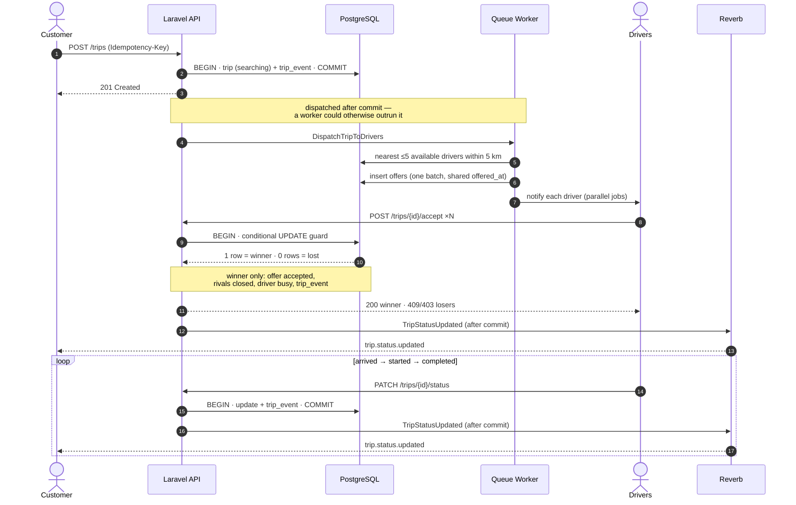
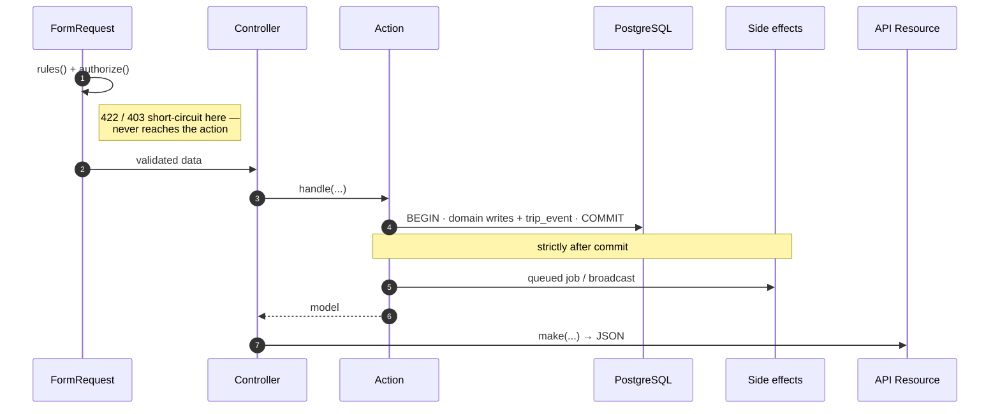
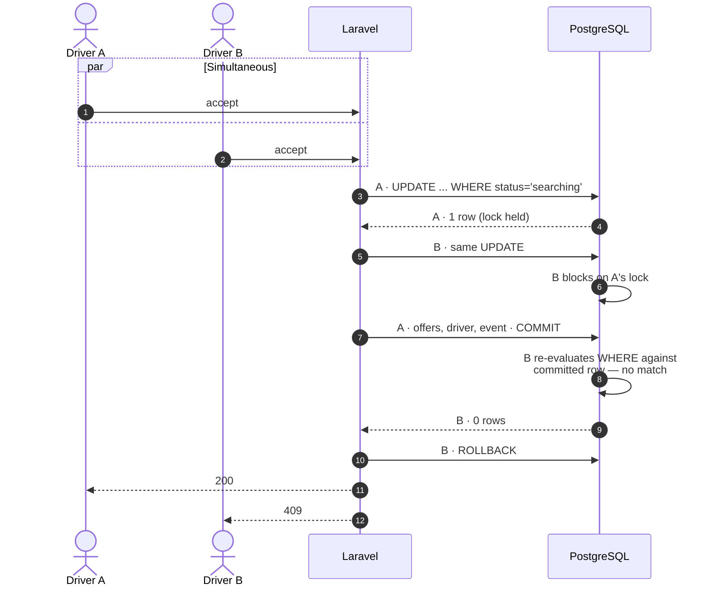
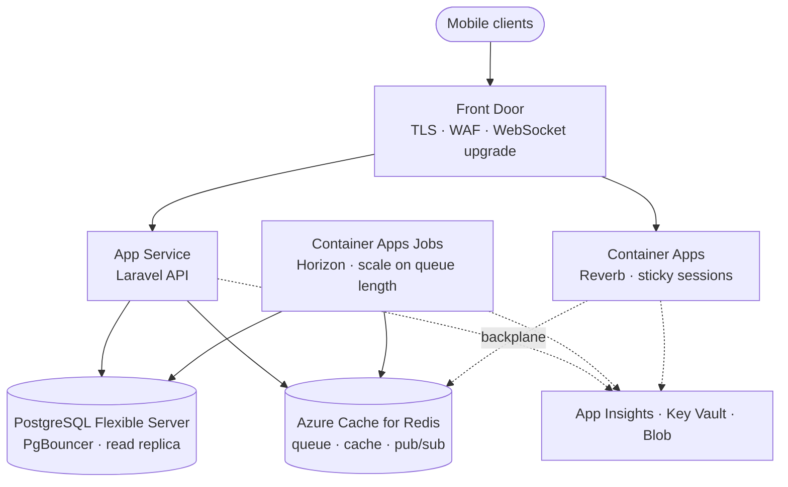

# RoadAssist — Real-Time Driver Dispatch API

Laravel + PostgreSQL backend for roadside assistance. A customer requests a tow,
the system offers it to the nearest available drivers at once, and **the first
driver to accept wins**. The customer watches progress live over WebSockets.

That last constraint — exactly one winner when five drivers tap "accept"
simultaneously — drove most of the design below.

---

## Quick start

**Requires** PHP 8.2+, PostgreSQL 15+, Composer, Node 18+ (verification script only).

```bash
composer install && cp .env.example .env && php artisan key:generate
```

```sql
CREATE DATABASE road_assist;
CREATE DATABASE road_assist_testing;
```

```bash
php artisan migrate --seed
```

**Three processes in development:**

```bash
php artisan serve          # API
php artisan queue:work     # dispatch + broadcast delivery
php artisan reverb:start   # WebSockets
```

Or start all of them (plus Vite and log tailing) with one command:

```bash
composer run dev
```

> Without the queue worker, trips are created but no driver is ever offered the
> job and no status update reaches the customer. Jobs pile up in the `jobs`
> table. This is the usual "nothing is happening" cause.

| Variable | `.env` | Tests | Why |
|---|---|---|---|
| `DB_DATABASE` | `road_assist` | `road_assist_testing` *(`.env.testing`)* | Tests never touch dev data |
| `QUEUE_CONNECTION` | `database` | `sync` *(`.env.testing`)* | Real async in dev, inline in tests |
| `BROADCAST_CONNECTION` | `reverb` | `null` *(`phpunit.xml`)* | Tests fake events |

Note the third row's source: `.env.testing` sets no broadcast driver at all —
the `null` value comes from `phpunit.xml`'s explicit `<env>` override, which
takes precedence over any dotenv file.

`REVERB_*` credentials are self-generated local values, not a paid Pusher
account — Reverb is self-hosted and merely speaks the Pusher protocol.

---

## Lifecycle



Every transition writes a `trip_events` row — a full audit trail of how a trip
reached its state and who caused each change.

---

## API

Base path `/api/v1`. Auth is simplified per the brief: `customer_id` /
`driver_id` are passed in requests and trusted.

| Endpoint | Purpose | Responses |
|---|---|---|
| `POST /trips` | Create a trip (requires `Idempotency-Key` header) | `201` new · `200` replay · `422` |
| `GET /trips/{trip}` | Trip with nested customer + driver | `200` · `404` |
| `POST /trips/{trip}/accept` | Driver accepts | `200` won · `409` lost race · `403` not offered · `422` |
| `PATCH /trips/{trip}/status` | Advance status | `200` · `403` wrong driver · `422` invalid transition |
| `GET /drivers/nearby` | Available drivers by distance | `200` · `422` |
| `POST /drivers/{driver}/location` | Update position | `200` · `404` · `422` |

**Create a trip**

```http
POST /api/v1/trips
Idempotency-Key: 9f8b2c14-5d3e-4a71-b6c9-1e2f3a4b5c6d

{ "customer_id": 1, "pickup_latitude": 24.4539,
  "pickup_longitude": 54.3773, "type": "normal" }
```

```json
{ "data": { "id": 1, "status": "searching", "type": "normal",
  "pickup": { "latitude": 24.4539, "longitude": 54.3773 },
  "created_at": "2026-08-24 23:19:34" } }
```

Same key again → `200` with the original trip and **no second dispatch**.
Missing header, malformed UUID, or unknown customer → `422`.

**Status transitions** are strictly sequential: `assigned → arrived → started →
completed`. Skipping a step is `422`. Only the assigned driver may advance a
trip. Completing it releases the driver back to `available`.

**Nearby drivers** accepts optional `radius_km` (0.1–50, default 5) and `limit`
(1–20, default 5), returns `distance` per driver, and only includes `available`
drivers with known coordinates.

---

## Architecture



Controllers are three lines: validate, call one Action, wrap in a Resource. All
logic lives in Actions.

**Everything that must be consistent is in one transaction; everything with an
external side effect happens strictly after commit.** A worker can pick up a job
within milliseconds — if the transaction hadn't committed, it would query a row
that doesn't exist.

```
app/
├── Actions/Trips/     CreateTrip · AcceptTrip · UpdateTripStatus
├── Actions/Drivers/   FindNearbyDrivers · UpdateDriverLocation
├── Jobs/              DispatchTripToDrivers · NotifyDriverOfOffer
├── Events/            TripStatusUpdated
├── Enums/ Exceptions/ Http/{Controllers,Requests,Resources} · Models/
```

Actions are plain classes — no package. `lorisleiva/laravel-actions` solves
"one operation, multiple entry points", which this project doesn't have.

---

## Key design decisions

### Concurrency — the accept guard

The naive approach is broken:

```php
$trip = Trip::find($id);
if ($trip->status === 'searching') {   // both requests see 'searching'
    $trip->update([...]);              // both proceed
}
```

There's a gap between reading and writing. No reordering closes it — another
connection can always land inside.

The implementation uses a **single conditional UPDATE**, reading the affected-row
count as the verdict:

```php
$affectedRows = Trip::query()
    ->where('id', $trip->id)
    ->where('status', TripStatus::Searching->value)
    ->whereNull('driver_id')
    ->update(['driver_id' => $driver->id,
              'status' => TripStatus::Assigned->value,
              'updated_at' => now()]);

throw_if($affectedRows === 0, new TripAlreadyAssignedException());
```

Postgres takes the row lock and evaluates the `WHERE` atomically within one
statement — there's no gap because there's no separate check.



**Why not `lockForUpdate()`?** It works, but costs two round trips and holds the
lock across both. The conditional update locks and releases in one statement, and
the affected-row count *is* the verdict — no separate check to get wrong.

Everything after the guard is unconditional, since only the winner reaches it:
offer accepted, rivals closed, driver busy, `trip_events` row. All five facts
commit together or not at all.

Measured cost: `Index Scan using trips_pkey · Buffers: shared hit=1 · Execution
Time: 0.162 ms`. The lock is held for microseconds, which is why 100 concurrent
attempts don't serialise.

### Idempotency

The key lives on `trips` — `idempotency_key uuid NOT NULL` with
`UNIQUE (customer_id, idempotency_key)`. No separate table.

The server never checks whether it has seen the key. It inserts and lets the
constraint decide:

```php
try {
    return DB::transaction(fn () => Trip::create([...]));
} catch (UniqueConstraintViolationException) {
    return Trip::where('customer_id', $data['customer_id'])
        ->where('idempotency_key', $data['idempotency_key'])
        ->firstOrFail();
}
```

Same reasoning as the accept guard: `SELECT` then `INSERT` has a window where
both requests find nothing and both insert. The constraint is atomic, so exactly
one wins. The exception isn't an error — it's the answer.

**Job dispatch sits outside the catch**, which makes this genuinely idempotent
rather than merely deduplicated: a replay returns the original trip without
firing a second round of offers.

**Native `uuid`, not `varchar`.** Postgres parses to 128 bits, so `9F8B…` and
`9f8b…` are the *same value*. On varchar they'd differ — an iOS client (uppercase
UUIDs) retrying a request logged in lowercase would slip past the constraint and
create a duplicate trip.

*Trade-off:* same key with a different payload returns the original trip rather
than `422`. That needs a stored request hash; it's client misuse, not a
correctness problem.

### Dispatch fairness

All offers are created in **one insert with a single shared timestamp** — a loop
would give each successive driver a later `offered_at` and the first a structural
head start. Notifications then fan out as parallel jobs.

**What this actually achieves:** the shared timestamp makes the fan-out
*auditable*; parallel jobs remove the head start sequential sending would
introduce. Neither produces simultaneous *arrival* — a driver on 5G beats one on
a weak signal regardless. The accurate claim is **no structural bias**; residual
variance is environmental.

### Nearby drivers

One query does filtering, distance, ordering, and limiting — filtering in PHP
would mean loading every available driver into memory to pick five.

```sql
SELECT id, name, latitude, longitude,
       (6371 * acos(least(1, greatest(-1,
           cos(radians(?)) * cos(radians(latitude)) *
           cos(radians(longitude) - radians(?)) +
           sin(radians(?)) * sin(radians(latitude))
       )))) AS distance
FROM drivers
WHERE status = 'available' AND latitude IS NOT NULL
  AND longitude IS NOT NULL AND <distance> <= 5
ORDER BY distance LIMIT 5
```

The `least/greatest` clamp prevents an `acos` domain error when rounding pushes
the cosine fractionally past ±1 — which happens when a driver is standing at the
pickup point. Null checks exclude drivers who never reported a position,
deliberately rather than by accident.

*(Strictly the spherical law of cosines, not true Haversine — they agree to well
under a metre here.)*

### Real-time

**One event, not four** — the transitions differ only in `from`/`to`, and the
client subscribes to one channel regardless.

**`ShouldBroadcast`, not `ShouldBroadcastNow`** — `Now` publishes synchronously
inside the request, putting a network call on the HTTP response path.

**Dispatched after commit** at both call sites, with `ShouldDispatchAfterCommit`
as a second guarantee. A subscriber must never see uncommitted state, and a
rolled-back transaction must never produce a broadcast.

**Public channel, and why.** The design started private with a `customer_id`
ownership check. It can't work here: Laravel's private-channel flow builds an
authorization *response* against the authenticated user, and this project has no
authentication (permitted by the brief). The failure is *downstream* of the
ownership check, so no callback logic substitutes for a real identity. Making the
channel public was preferable to introducing an entire auth architecture solely
to satisfy a broadcasting precondition.

> **Not a security boundary.** Any client knowing a trip ID can subscribe. In
> production this is a private channel authorized against the authenticated
> customer — that design is correct, it just depends on something this project
> deliberately lacks.

**Driver included whenever the trip has one**, not only on assignment. Events
must be self-contained: a client reconnecting mid-trip (backgrounded app, network
switch, worker restart) renders correctly from the next event alone.

**No driver coordinates in status events.** These fire four times across ~20
minutes; an embedded coordinate is stale on arrival but *looks* live. Live
tracking is a separate concern with a different cadence.

---

## Schema

```
customers            drivers                      trips
─────────            ───────                      ─────
id                   id                           id
name                 name                         customer_id      FK
timestamps           latitude   decimal(10,7)     driver_id        FK, NULL until accepted ◄──
                     longitude  decimal(10,7)     pickup_latitude  decimal(10,7)
                     status     available|busy|   pickup_longitude decimal(10,7)
                                offline           type             normal|flatbed
                                                  status           searching|assigned|
trip_driver_offers            trip_events                          arrived|started|completed
──────────────────            ───────────                         idempotency_key  uuid
id                            id                 UNIQUE (customer_id, idempotency_key)
trip_id    FK, cascade        trip_id  FK, cascade
driver_id  FK                 from_status (null on creation)
status     pending|accepted|  to_status
           closed             actor_type / actor_id
offered_at timestamp          created_at only — append-only
UNIQUE (trip_id, driver_id)
```

**`trips.driver_id` nullable is the design.** A trip is born with no driver; the
accept operation is the moment it goes from null to a value, and
`WHERE driver_id IS NULL` is part of the guard.

**Enums as strings with PHP enum casts**, not native Postgres enums — adding a
value to a native enum needs `ALTER TYPE`.

**`trip_events` is append-only** (`created_at` only) with raw string statuses, so
historical rows survive an enum rename.

**Cascades follow ownership** — a trip *owns* its offers and events (cascade); a
driver is merely *referenced* (restrict).

**`trips.driver_id` is intentionally unindexed** — no endpoint filters trips by
driver, and drivers are never deleted, so there's no FK cascade check either.
`customer_id` is covered as the leftmost column of the unique constraint.

---

## Real-time contract

No client app is included. Channel `trip.{tripId}` (public), event
`trip.status.updated`.

```js
const pusher = new Pusher(REVERB_APP_KEY, {
    wsHost: 'localhost', wsPort: 8080,
    forceTLS: false, enabledTransports: ['ws'],
    cluster: 'mt1',   // pusher-js validation requirement; unused
});

new Echo({ broadcaster: 'reverb', client: pusher })
    .channel(`trip.${tripId}`)
    .listen('.trip.status.updated', payload => { /* ... */ });
```

The **leading dot** tells Echo the name is literal, not a namespaced class.
Without it, nothing arrives.

```json
{ "trip_id": 1, "from_status": "assigned", "to_status": "arrived",
  "updated_at": "2026-08-24T23:21:30+00:00",
  "driver": { "id": 1, "name": "Driver 1" } }
```

---

## Testing

```bash
php artisan test
```

**41 tests, 106 assertions.** All pass. Only the concurrency test needs external
setup — it self-skips with instructions if a server isn't reachable.

```bash
APP_ENV=testing php artisan migrate
APP_ENV=testing php artisan serve --port=8001   # terminal 1
php artisan test                                # terminal 2
```

| Suite | Covers |
|---|---|
| `Feature/Trip/StoreTripTest` | Create + idempotency replay (201/200, no re-dispatch), validation |
| `Feature/Trip/ShowTripTest` | Response shape, null-driver case, 404 |
| `Feature/Trip/AcceptTripTest` | Success + state assertions, 403, 409, 422, 404 |
| `Feature/Trip/UpdateTripStatusTest` | Each transition, driver release on completion, 403, 422, 404 |
| `Feature/Driver/NearbyDriversTest` | Ordering, distance formatting, radius/limit, exclusions, validation |
| `Feature/Driver/UpdateDriverLocationTest` | Success, response shape, 404, validation |
| `Feature/Events/TripBroadcastTest` | Payload per transition; **no dispatch on rollback** |
| `Feature/Concurrency/AcceptTripConcurrencyTest` | 100 concurrent accepts → exactly one winner |

The concurrency test uses `DatabaseTruncation` and its own `tearDown()` to clean
up the rows it creates, so it doesn't leak state into the `RefreshDatabase`-based
tests sharing the same database.

### Concurrency test

`AcceptTripConcurrencyTest` seeds one trip and 100 drivers each holding a pending
offer, fires 100 concurrent accepts via `Http::pool()`, and asserts: exactly one
`200`; 99 rejected; one offer `accepted` and 99 `closed`; one driver `busy`; one
`trip_events` row for `searching → assigned`; and `trips.driver_id` matching the
accepted offer.

**Why losers split between 403 and 409.** All 100 pass the eligibility check
initially. The winner's transaction closes the other 99 offers. A loser whose
check runs *after* that commit sees a closed offer → **403**, never reaching the
guard. A loser whose check ran *before* enters the transaction → **409** from the
affected-rows guard. Both are correct; the split depends on arrival order within
a sub-millisecond window, so asserting a fixed ratio would be flaky by design.
**The database assertions are the real proof** — deterministic regardless of
timing.

**Two things that would silently break it:** `RefreshDatabase` wraps each test in
a transaction, leaving seed data invisible to other connections (the race would
never occur) — `DatabaseTruncation` is used instead. And a leftover `sqlite`
override in `phpunit.xml` would replace Postgres, so the test asserts
`getDriverName() === 'pgsql'`.

### Real-time

`TripBroadcastTest` uses `Event::fake()` to verify each transition dispatches the
right payload, and that **no event fires when a transaction rolls back**.

`Event::fake()` does *not* prove the event is queued, published, or received — it
bypasses all of that. Hence:

**End-to-end verification.** `scripts/testRealTimeForClient.mjs` is a standalone
WebSocket client (verification tool, not application code) so the real-time claim
is reproducible:

```bash
php artisan reverb:start --debug              # 1
php artisan queue:work                        # 2
node scripts/testRealTimeForClient.mjs 1      # 3
# trigger transitions via curl/Postman
```

There is deliberately **no automated test** for this path — asserting a real
WebSocket round-trip would require a running Reverb server and a queue worker in
CI, which is a lot of machinery for a property the script verifies in under a
minute by hand.

**Result:** one trip driven through all four transitions on a single continuous
subscription — the same Reverb connection id across all four broadcasts,
interleaved with pings, so the client did not silently reconnect. Confirmed at
both ends: Reverb's `--debug` showed `Broadcasting To trip.1` for each, and the
client received all four. Final state correct (trip `completed`, driver released
to `available`), confirming the broadcast layer doesn't interfere with the
business transaction.

Negative paths at the wire level: a rejected transition returns `422` with the
listener silent; an ineligible accept returns `403` with no broadcast. The `409`
mid-transaction rollback is covered by
`TripBroadcastTest::test_no_broadcast_when_the_race_is_lost`.

---

## Performance

Measured locally with `EXPLAIN ANALYZE` on PostgreSQL 18. **The generated
datasets and query scripts behind the larger figures are not committed to this
repository**, so the table below is a record of what was observed rather than
something a reader can reproduce from a clean clone. The accept-guard plan is
reproducible against any seeded database.

**Accept guard:** `0.162 ms` — index scan on `trips_pkey`, one buffer hit, no
disk reads.

**Nearby-driver query:**

| Drivers | In filter | Plan | Execution |
|---|---|---|---|
| 13 | 13 | Seq Scan | 0.065 ms |
| 100,013 | 18,224 | Parallel Seq Scan | 19.7 ms |
| 500,000 | 500,000 | Seq Scan, 1 CPU / 1 GB, no parallelism | 659 ms |

The 500k row is a deliberate stress test, not a projection — every driver
available with live coordinates in a tiny area, impossible for tow trucks in two
cities. Its value is showing **linear scaling with candidate rows**: at a
plausible ceiling of ~2,000 available drivers that extrapolates to single-digit
milliseconds. The dominant cost is scanning candidates and evaluating the
distance expression, not the `LIMIT` or sort.

The query also runs inside a queued job, so the customer's response has already
returned — far more latency headroom than a synchronous endpoint.

---

## Scaling

What breaks → the metric that signals it → what to do.

| Layer | Breaks | Metric | Action |
|---|---|---|---|
| **DB connections** *(first to break)* | Each PHP worker holds a connection; Postgres forks per connection | `pg_stat_activity` near `max_connections` | PgBouncer, transaction mode — higher leverage than any replica |
| **Location writes** *(real pressure point)* | 100–200 writes/sec at 1k drivers, on rows dispatch also reads | >~100 updates/sec; autovacuum falling behind | Current position → Redis `GEOADD`/`GEOSEARCH`, Postgres as durable record |
| **Geo query** | Distance computed per candidate row | `EXPLAIN ANALYZE` >~50 ms, or >2,000 rows removed by filter | Bounding-box prefilter + index on `(status, latitude, longitude)` |
| **PostGIS** | — | A *second* spatial workload: geofencing, service areas, true KNN | Workload variety justifies it, not row count |
| **Read load** | Read queries saturate CPU | DB CPU >70% sustained | Read replicas — but route read-after-write (incl. idempotency replay) to the primary |
| **Write volume** | `trip_events` grows unbounded | Write latency climbing | Partition `trip_events` by time; shard by city (dispatch is inherently local) |
| **Queues** | Dispatch backs up, drivers get offers late | Queue wait >few seconds | Horizon autoscaling; **separate queues by priority** — dispatch is latency-critical, notifications aren't |
| **WebSockets** | One Reverb node caps at a few thousand connections | Connection count near capacity | Horizontal Reverb + Redis pub/sub backplane, or managed Pusher/Ably |
| **App tier** | FPM workers saturate | Active workers >80% of `pm.max_children` | Horizontal scale — the API is stateless |
| **Maps APIs** | Rate limits and cost | Approaching quota | Cache geocoding, batch, precompute routes |

**Bounding-box caveat:** the box must be *wider* than the radius (longitude
degrees shrink by `cos(latitude)`). A narrow box silently drops eligible drivers,
and a silent under-fetch in dispatch is worse than a slow query.

---

## Azure



**Migration order:** database (with a dump/restore rehearsal) → Redis → API
behind Front Door → workers → Reverb last, since it's the only stateful tier
needing sticky routing.

**Two things needing care:** WebSockets require sticky sessions and Front Door
WebSocket-upgrade config; multiple Reverb replicas need the Redis backplane or
clients on replica A miss events published from replica B. And migrations must be
a **release-gated step**, not run on container startup — otherwise every
autoscaled instance races to migrate the same database.

---

## Deliberate omissions

Each was considered, with the trigger that would change the decision.

| Omitted | Why / trigger |
|---|---|
| **Authentication** | Explicitly permitted by the brief. Also why the broadcast channel is public. |
| **Offer expiry / timeout** | A trip nobody accepts stays `searching` forever — a known dead end. Needs a scheduled expiry job, re-dispatch, and a `no_driver_found` state. |
| **Trip cancellation** | No cancel endpoint or `cancelled` status; the enum covers the happy path. |
| **One-active-trip-per-driver constraint** | Enforced in practice via `busy`, not at the DB level. Needs a partial unique index. |
| **`request_hash` on idempotency keys** | Same key + different payload returns the original trip. Client misuse, not a correctness issue. |
| **Index on `trips.driver_id`** | Nothing filters by it and drivers are never deleted. *Trigger:* a driver trip-history endpoint or deletion path. |
| **Bounding box on the geo query** | Measured, not needed at plausible volumes. *Trigger:* `EXPLAIN ANALYZE` >~50 ms. |
| **PostGIS / Redis GEO** | *Trigger:* a second spatial workload; location writes >~100/sec. |
| **Real push notifications** | `NotifyDriverOfOffer` logs instead of calling FCM/APNs — mocking permitted. Job structure, retries, and parallel fan-out are real; only the transport is stubbed. |
| **Live location broadcasting** | Only status transitions. Live tracking needs a separate higher-frequency channel, deliberately not mixed in. |
| **State-machine package** | A minimal `match` expression enforces sequential transitions. |
| **Pricing, payments, ratings, fleet management** | Outside the brief. |

---

## Next steps

1. Offer expiry with re-dispatch — the most user-visible gap
2. Real authentication, which unlocks private broadcast channels
3. Trip cancellation with refund/fee rules
4. Redis GEO once location write volume justifies it